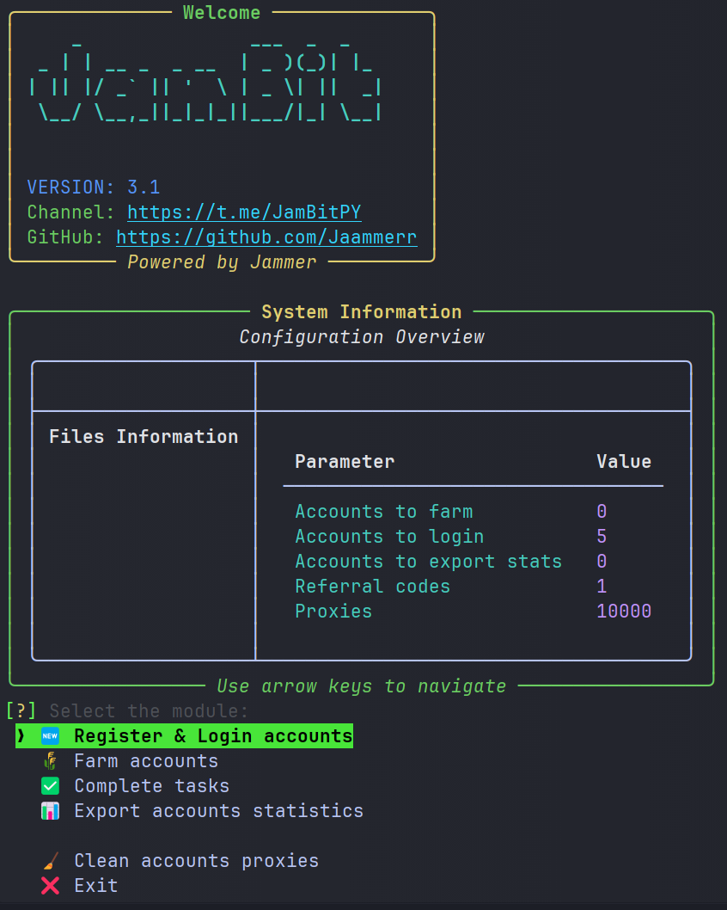

# 🌅 Dawn Extension Bot [v3.0]

  
  
  

    
    
  

---

## 💸 Free to Use

**The Dawn Bot** is completely free to use.  
No payments, no hidden fees — just download and start automating.

---

## 📘 Guides

> 🛠 **[Installation Guide](https://jammers-organization.gitbook.io/jambit/depin/the-dawn/installation)**  
> 📖 **[User Guide – Getting Started](https://jammers-organization.gitbook.io/jambit/depin/the-dawn/user-guide-getting-started)**

Detailed step-by-step instructions to help you install and use **The Dawn Bot** effectively.

---

## 🧩 Modules

- Register & Login accounts 
- Farm accounts  
- Complete tasks (will be added as soon as devs fix them)
- Export accounts statistics  
- Clean accounts proxies

---

## 💻 Requirements

- Python 3.11 or higher
- Stable internet connection
- Valid email accounts
- Working proxies (HTTP/SOCKS5)

---
