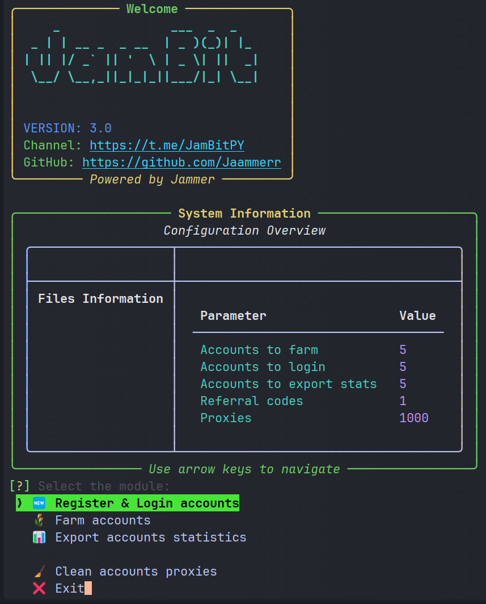

# 🌅 Dawn Extension Bot [v1.8]

<div align="center">
  
  
  <p align="center">
    <a href="https://t.me/JamBitPY">
      
    </a>
    <a href="https://t.me/JamBitChat">
      
    </a>
  </p>
</div>

## 📋 Table of Contents
- [Features](#-features)
- [Requirements](#-requirements)
- [Installation](#-installation)
- [Configuration](#%EF%B8%8F-configuration)
- [Usage](#-usage)
- [Troubleshooting](#-troubleshooting)

## 🚀 Features

- ✨ **Account Management**
  - ✅ Automatic account registration and login
  - 📧 Smart account reverification system
  - 🛡️ Token-based authentication storage
  
- 🤖 **Automation**
  - 🌾 Intelligent task completion
  - 💰 Optimized point farming
  - 🔄 Advanced keepalive system
  
- 📊 **Analytics & Export**
  - 📈 Comprehensive account statistics
  - 📉 Banned account tracking
  - 📋 Unverified account monitoring
  
- 🔒 **Security**
  - 🧩 Advanced captcha solving integration
  - 🌐 Proxy support (HTTP/SOCKS5)
  - 🔐 Secure email integration

## 💻 Requirements

- Python 3.11 or higher
- Stable internet connection
- Valid email accounts
- Working proxies (HTTP/SOCKS5)
- Captcha service subscription (2captcha/anticaptcha)

## 🛠️ Installation

1. **Clone the Repository**
   ```bash
   git clone [repository URL]
   ```

2. **Set Up Virtual Environment**
   ```bash
   python -m venv venv
   source venv/Scripts/activate  # Windows
   source venv/bin/activate      # Unix/MacOS
   ```

3. **Install Dependencies**
   ```bash
   pip install -r requirements.txt
   ```

## ⚙️ Configuration

### 📁 settings.yaml

```yaml
# ═══════════════════════════════════════════════════════════════════════════
#                     APPLICATION CONFIGURATION
# ═══════════════════════════════════════════════════════════════════════════

# Master configuration file for the application's core services and functionality.
# Includes settings for multi-threading, email handling, and security features.

# ┏━━━━━━━━━━━━━━━━━━━━━┓
# ┃     CORE SETTINGS    ┃
# ┗━━━━━━━━━━━━━━━━━━━━━┛
# Foundation settings that determine the application's basic operational parameters

threads: 3                     # Controls parallel processing capacity
                              # Higher values increase performance but consume more resources

use_proxy_for_imap: false     # Enables secure proxy routing for IMAP connections
                              # Recommended for enhanced privacy and security

keepalive_interval: 300       # Connection monitoring frequency (seconds)
                              # Ensures stable network connectivity

use_single_imap: # use one imap server for all accounts
    enabled: false
    imap_server: "imap.gmail.com"

# ┏━━━━━━━━━━━━━━━━━━━━━┓
# ┃  EMAIL REDIRECTION   ┃
# ┗━━━━━━━━━━━━━━━━━━━━━┛
# Configuration for automated email forwarding and handling

redirect_settings:
    enabled: false            # Main switch for email redirection system
    email: ""                 # Target email for redirected messages
    password: ""              # Access credentials (use secure storage!)
    imap_server: ""           # Mail server address
    use_proxy: false          # Optional proxy protection layer

# ┏━━━━━━━━━━━━━━━━━━━━━┓
# ┃   CAPTCHA SERVICES   ┃
# ┗━━━━━━━━━━━━━━━━━━━━━┛
# Integration settings for automated CAPTCHA resolution

captcha_module: 2captcha      # CAPTCHA service selection:
                              # ► 2captcha: Primary solution
                              # ► anticaptcha: Secondary option

two_captcha_api_key: "18f4fb27711cac1838e6425e06779b49"       # Authentication key for 2captcha
anti_captcha_api_key: "05f16e2bfe825feaf4af7ed52acfa979"      # Authentication key for anticaptcha

# ┏━━━━━━━━━━━━━━━━━━━━━┓
# ┃   STARTUP TIMING     ┃
# ┗━━━━━━━━━━━━━━━━━━━━━┛
# Application initialization delay configuration

delay_before_start:
    min: 2                    # Minimum delay duration (seconds)
    max: 3                    # Maximum delay duration (seconds)
                              # System will randomly select a value in this range

# ┏━━━━━━━━━━━━━━━━━━━━━┓
# ┃ MAIL SERVER REGISTRY ┃
# ┗━━━━━━━━━━━━━━━━━━━━━┛
# Comprehensive IMAP server mappings for supported email providers

imap_settings:
    # ▼ Global Services
    gmail.com: imap.gmail.com           # Google Mail (SSL required)
    yahoo.com: imap.mail.yahoo.com      # Yahoo Mail (SSL required)
    icloud.com: imap.mail.me.com        # Apple iCloud (2FA might be needed)

    # ▼ Russian Services
    mail.ru: imap.mail.ru               # Mail.ru service

    # ▼ European Providers
    gmx.com: imap.gmx.com               # GMX International
    gmx.net: imap.gmx.net               # GMX Germany - Primary
    gmx.de: imap.gmx.net                # GMX Germany - Secondary

    # ▼ Polish Services
    onet.pl: imap.poczta.onet.pl        # Onet Mail - Primary
    onet.com.pl: imap.poczta.onet.pl    # Onet Mail - Secondary
    op.pl: imap.poczta.onet.pl          # Onet Mail - Legacy
    onet.eu: imap.poczta.onet.pl        # Onet Mail - European
    gazeta.pl: imap.gazeta.pl           # Gazeta Mail Service
```

### 📁 Input Files Structure

#### data/register.txt
```
email:password
email:password
```

#### data/farm.txt
```
email:password
email:password
```

#### data/reverify.txt
```
email:password
email:password
```

#### data/proxies.txt
```
http://user:pass@ip:port
http://ip:port:user:pass
socks5://user:pass@ip:port
```

#### data/referral_codes.txt
```
hegbhf
hegbhf
hegbhf
```

## 🚀 Usage

1. Configure all necessary files as described above
2. Start the bot:
   ```bash
   python run.py
   ```

## ⚠️ Important Notes

- 🕒 Recommended keepalive interval: 120 seconds
- 📧 Gmail/Icloud users: Use App-Specific Passwords
- 🔄 Unverified accounts can be reverified using the register module
- 💾 Authorization tokens are stored in local database
- 🤖 External captcha services required (2captcha/anticaptcha)

## 🔧 Troubleshooting

### Common Issues and Solutions

#### 📧 Email Verification Failed
- Verify IMAP settings in settings.yaml
- Check email provider's security settings
- Ensure app-specific password for Gmail

#### 🧩 Captcha Problems
- Verify API key validity
- Check service balance
- Ensure selected service is operational

#### 🌐 Proxy Issues
- Validate proxy format
- Check proxy functionality
- Ensure proxy authentication is correct
